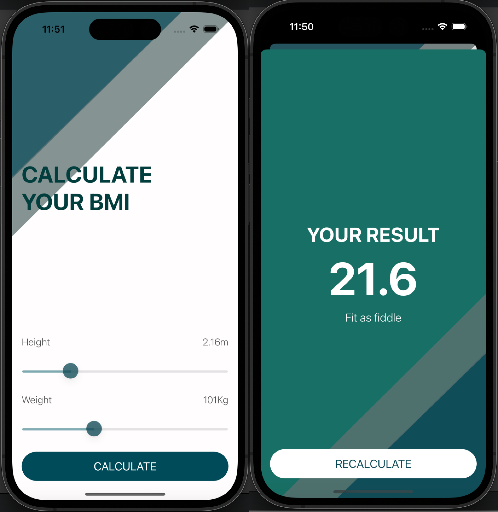

## What i will create

I will have made a Body Mass Index calculator. Based on the user’s weight and height it will calculate their body mass and give a piece of health advice depending on whether if they have eaten too many pies or if they need to eat more pies. 

## What do i use?

* I create multi-screen apps with animated navigation.
* Optional binding, optional chaining and the nil coalescing operator.
* I use classes and difference between classes and structs. 
* Pass by value vs. pass by reference. 

## Application images

--------------------------------------------------------------------------

